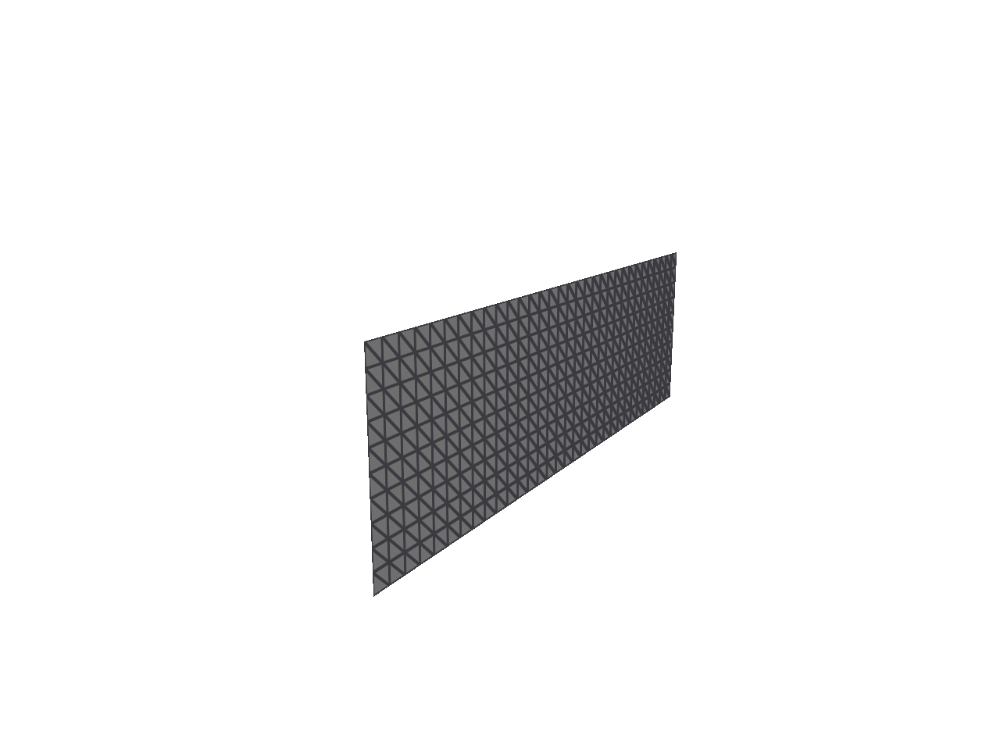
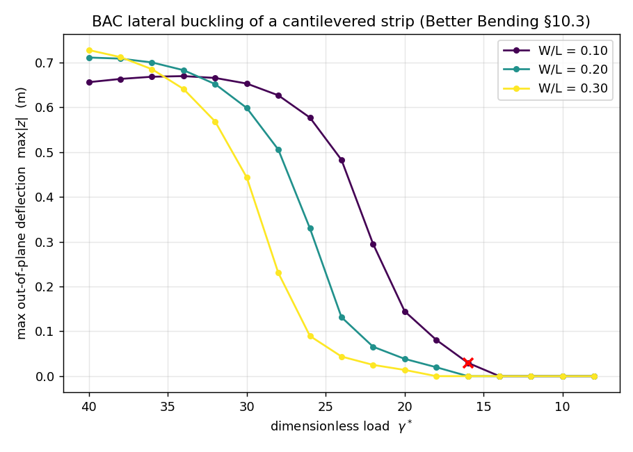

# Bending-Active Cosserat (BAC) — a minimal TinyAD reproduction

A small, self-contained reproduction of the **Bending-Active Cosserat (BAC)** thin-shell
bending model and its flagship *lateral-buckling* result from:

> Zhen Chen, Etienne Vouga, Danny M. Kaufman.
> **Better Bending: Analysis, Construction and Verification of Discrete Bending Models
> for Kirchhoff–Love Shells.** SIGGRAPH 2026.

BAC is the midedge-director shell discretization whose discrete second fundamental form
uses a **`tan(α)` hinge measure**, giving an *energy barrier* as a hinge folds toward
180°. In LibShell it is the `MidedgeAngleTanFormulation`.

Everything here is built on **[TinyAD](https://github.com/patr-schm/TinyAD)** (automatic
gradients + sparse Hessians), with a small projected-Newton solver, and headless
**polyscope** (EGL) for rendering. It does **not** depend on LibShell, better-bending, or
any physics-energy library — those upstream repos are used only as a numerical
*validation oracle* during development (see `reference/`).

<p align="center">
  
  
</p>

## The flagship result: lateral (lateral-torsional) buckling

Following *Better Bending* §10.3 (a reproduction of Romero et al.), a thin strip of
length `L`, width/depth `W`, and thickness `h` is clamped along one short edge and loaded
by a body force of dimensionless magnitude `γ*` along its stiff in-plane direction. Below
a critical `γ*` the strip stays planar; above it, it buckles out of plane by twisting.

We sweep `γ*` from high to low with Newton continuation and record the maximum
out-of-plane deflection `max|z|`. The result is a clean pitchfork bifurcation whose
critical load increases with width — the curve above (left: the buckled shape animating
as the load varies; right: `max|z|` vs `γ*` for three widths).

```bash
# reproduce the curve (writes results/buckling.csv + per-frame OBJs)
./build/lateral_buckling 32 40 8 2  0.1 0.2 0.3
python3 scripts/plot_buckling.py results/buckling.csv docs/buckling_curve.png
```

## The model

Degrees of freedom: vertex positions `q ∈ R^{3V}` plus one director angle `θ_e` per edge.

For each face with vertices `q0,q1,q2` and local edges `i=0,1,2` (edge `i` opposite
vertex `i`):

- first fundamental form `a` (edge Gram matrix);
- altitude `hᵢ` from vertex `i` to the opposite edge;
- dihedral angle `θᵢ` at edge `i` (signed angle between incident face normals);
- **director angle** `αᵢ = θᵢ/2 + orientᵢ · θ_edge(i)`;
- **BAC hinge measure** `IIᵢ = 2 hᵢ tan(αᵢ)`   ← the `tan` barrier;
- second fundamental form `b = [[II₀+II₁, II₀], [II₀, II₀+II₂]]`.

Energy per face, with rest forms `ā, b̄`, thickness `t`, Lamé `α, β` and
`dA = ½√det(ā)`:

```
M_s = ā⁻¹(a − ā)     membrane = (t/4)·dA·(½α tr(M_s)² + β tr(M_s²))
M_b = ā⁻¹(b − b̄)     bending  = (t³/12)·dA·(½α tr(M_b)² + β tr(M_b²))
```

with 2D Lamé parameters `α = Yν/(1−ν²)`, `β = Y/(2(1+ν))`. The whole per-face energy is a
TinyAD element, so gradients and (PSD-projected) sparse Hessians are automatic.

The `tan(α)` in `IIᵢ` diverges as `α → π/2` (a hinge folding to 180°): that is the BAC
energy barrier that prevents coarse meshes from collapsing high-curvature folds. The
solver enforces `|α| < π/2` throughout the line search.

## Verification

`./build/validate` checks the energy at several levels:

| check | result |
|---|---|
| connectivity (edges/apex adjacency) | exact |
| flat rest + flat config → bending energy, gradient | `0` |
| rigid-motion invariance of the energy | `< 5e-17` |
| TinyAD gradient vs finite differences | `2e-8` |
| TinyAD Hessian vs finite differences | `2e-7` |
| **energy vs LibShell `MidedgeAngleTanFormulation`+StVK** | **`0.0` (exact)** |
| **gradient vs LibShell** | **`3e-13`** |

The last two compare, on a randomly-deformed strip, against a golden dump produced by
linking LibShell directly (`reference/dump_golden.cpp`) — confirming this from-scratch
TinyAD implementation reproduces the paper's actual energy to machine precision.

The projected-Newton and true-Hessian solver modes were checked to reach **identical**
buckling equilibria (`max|z|` agreeing to 4+ digits).

## Solver

`src/Solver.h` is a projected Newton solver over the free DOFs (pinned DOFs held by a
selection matrix):

- per-element **PSD-projected** Hessian from TinyAD (`opt.projected=true`), or the true
  Hessian with adaptive positive-definite regularization (faster on the stiff,
  near-inextensible membrane, `(L/h)²` conditioning) — both reach the same equilibria;
- backtracking Armijo line search with the `tan`-barrier validity guard;
- iterative refinement on the linear solve;
- optional **implicit-Euler inertia** term for dynamics.

## Bonus: dynamic drape

`apps/drape.cpp` steps a square sheet (StVK membrane + BAC bending + lumped inertia)
under gravity with backward Euler, each step a projected-Newton solve of the incremental
potential. It renders frames headlessly. `docs/drape.gif` shows the result.

## Build

Core (Eigen + TinyAD only; fetched automatically):

```bash
cmake -S . -B build -DCMAKE_BUILD_TYPE=Release
cmake --build build -j10          # -> validate, test_solver, lateral_buckling, bench_solver
./build/validate
./build/lateral_buckling
```

With rendering (adds headless polyscope via EGL):

```bash
cmake -S . -B build-render -DBAC_WITH_RENDER=ON -DCMAKE_BUILD_TYPE=Release
cmake --build build-render -j10   # -> render_frames, drape
```

Requires a Linux box with EGL (`EGL/egl.h`); on this hardware an NVIDIA GPU is used for
offscreen rendering.

## Layout

```
src/    MeshConnectivity, BACModel (TinyAD energy), Solver (projected Newton),
        Meshes (grid + OBJ IO), Render (polyscope EGL)
apps/   validate, test_solver, lateral_buckling, bench_solver, render_frames, drape
scripts/ plot_buckling.py, make_gif.py
docs/   committed figures/GIFs
reference/  (git-ignored) upstream repos used only as a validation oracle
PLAN.md  model description + milestone/testing plan
```

## Notes / honesty

- Thickness in the flagship is the paper value `h = 1e-3` with `D = 1` (so `Y ≈ 1e10`);
  we verified the dimensionless `γ*` curve is essentially unchanged for thicker strips
  (the membrane/bending contrast only needs to be large).
- Meshes and the `γ*` step are kept modest so the whole sweep runs in minutes rather than
  the paper's "several hours"; the bifurcation is fully resolved. One point at the very
  onset of buckling (`W/L=0.1, γ*=16`) hits the iteration cap due to critical slowing —
  marked with an ✗ on the plot.
